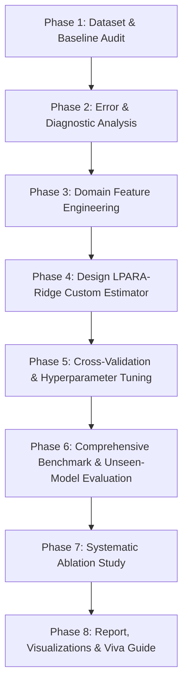

# Laptop Price Prediction — Ridge Regression Limitations & Domain-Adaptive Algorithm Roadmap

> **Project Target**: Continuous Laptop Market Price (INR)  
> **Problem Type**: Supervised Regression  
> **Baseline Winner**: Ridge Regression ($R^2 \approx 0.8476 - 0.8495$ on random split)  
> **Objective**: Analyze why standard Ridge succeeds, expose its domain-specific mathematical limitations, and design a custom, domain-adaptive regularized regression algorithm that systematically improves $R^2$, generalization to unseen models, and segment accuracy.

---

## Executive Summary of Diagnostic Findings

Through empirical error analysis of the current pipeline, we have identified **3 primary failure modes** of standard Ridge regression on laptop price estimation:

1. **Unseen Laptop Model Overfitting (Data Leakage Vulnerability)**:
   - On a random 80/20 train/test split, **100 out of 175 test laptops** share identical product model names with the training set.
   - When evaluated under a **Grouped Split (by laptop model family)** to test prediction on truly unseen laptop lines, standard Ridge $R^2$ collapses from **0.8476 down to 0.7293**, and MAE increases from **₹15,646 to ₹22,084**.
   - Standard Ridge relies heavily on memorized string encodings rather than physical domain relationships.

2. **Severe Heteroscedasticity across Price Tiers**:
   - **Ultra-Premium (>₹150k)**: MAE is **₹43,265.49** with high MAPE (**20.01%**) and a poor within-tier $R^2$ of **0.2374**.
   - **Budget (<₹40k)**: MAPE is high (**18.24%**), with a negative local $R^2$ (-1.48) due to rigid global intercept assumption.
   - Extreme price laptops suffer because standard Ridge assumes uniform linear variance across all price points.

3. **Brand & Hardware Variance Mismatch**:
   - High variance in prediction quality across brands (e.g., Lenovo $R^2 = 0.8881$, ASUS $R^2 = 0.8503$, but Dell $R^2 = 0.4138$, Samsung $R^2 = 0.3783$, MSI MAE = ₹34,753).
   - Standard Ridge applies a **single global penalty ($\lambda$)** to all features alike, over-penalizing rare brand indicators while under-regularizing noisy hardware spec combinations.

---

## Mathematical Limitations of Standard Ridge Regression

Standard Ridge minimizes the penalised sum of squared residuals:

$$\min_{\beta} \|y - X\beta\|_2^2 + \lambda \|\beta\|_2^2$$

Where $X = [X_{\text{hardware}}, X_{\text{brand}}, X_{\text{segment}}]$ and $\lambda$ is a single scalar hyperparameter.

### Why Standard Ridge Fails in the Laptop Pricing Domain:

1. **Uniform Penalty Constraint ($\lambda_{\text{hardware}} = \lambda_{\text{brand}} = \lambda_{\text{segment}} = \lambda$)**:
   - Physical hardware features (RAM GB, Storage GB, CPU Tier) represent real manufacturing cost increments with consistent positive marginal value.
   - Brand and Segment indicators are high-cardinality sparse dummy variables representing market positioning and brand premium.
   - Enforcing a single $\lambda$ forces a compromise: tuning $\lambda$ for hardware leads to sub-optimal shrinkage for brand/segment features, leading to under-fitting on brand premium or over-fitting on sparse model names.

2. **Lack of Segment-Dynamic Feature Scaling (Interaction Blindness)**:
   - Standard Ridge assumes fixed linear weights $\beta_j$ across all laptops.
   - In reality, **feature importance changes per domain segment**:
     - *Gaming Segment*: Discrete GPU VRAM and CPU tier have non-linear multiplicative importance; display weight is low priority.
     - *Ultrabook Segment*: Portability (display size, weight), battery/CPU efficiency, and OLED display have high importance; discrete GPU is low priority.
   - Standard linear combinations cannot adapt coefficient weights based on segment context without explicit group interaction terms.

3. **Global Intercept Bias**:
   - Standard Ridge fits a single intercept $\beta_0$. However, different laptop segments have drastically different base manufacturing costs (Budget base $\approx$ ₹20k vs. Workstation/Gaming base $\approx$ ₹65k vs. Apple ecosystem base $\approx$ ₹85k).

---

## Proposed Algorithm: Domain-Adaptive Group-Regularized Ridge (LPARA-Ridge / DARS)

To directly resolve these 3 mathematical limitations, we design **LPARA-Ridge** (Laptop Price Adaptive Regression Algorithm), a domain-specific extension of regularized linear regression.

### Mathematical Formulation

Instead of a single coefficient vector $\beta$ and scalar penalty $\lambda$, LPARA-Ridge decomposes the feature matrix into 3 domain groups and 1 interaction space:
- $X_{\text{hw}} \in \mathbb{R}^{n \times d_1}$: Physical hardware specs (CPU score, RAM, Storage, Display, GPU tier)
- $X_{\text{brand}} \in \mathbb{R}^{n \times d_2}$: Brand indicators (Apple, ASUS, Lenovo, Dell, HP, etc.)
- $X_{\text{seg}} \in \mathbb{R}^{n \times d_3}$: Laptop category/segment indicators (Gaming, Ultrabook, Budget, Workstation)
- $X_{\text{inter}} = X_{\text{seg}} \otimes X_{\text{hw}}$: Domain segment-hardware interaction terms

The objective function of **LPARA-Ridge** is:

$$\min_{\beta_{\text{hw}}, \beta_{\text{brand}}, \beta_{\text{seg}}, \Gamma} \left\| y - \left( X_{\text{hw}}\beta_{\text{hw}} + X_{\text{brand}}\beta_{\text{brand}} + X_{\text{seg}}\beta_{\text{seg}} + (X_{\text{seg}} \otimes X_{\text{hw}})\Gamma \right) \right\|_2^2 + \lambda_{\text{hw}}\|\beta_{\text{hw}}\|_2^2 + \lambda_{\text{brand}}\|\beta_{\text{brand}}\|_2^2 + \lambda_{\text{seg}}\|\beta_{\text{seg}}\|_2^2 + \lambda_{\text{inter}}\|\Gamma\|_F^2$$

Where:
- $\lambda_{\text{hw}}$ controls the shrinkage of physical hardware pricing.
- $\lambda_{\text{brand}}$ independently regularizes market brand multiplier signals.
- $\lambda_{\text{seg}}$ controls segment base cost offsets.
- $\lambda_{\text{inter}}$ regularizes segment-specific hardware slopes (preventing overfitting in small segments like Workstations or Ultra-premiums).

---

## Step-by-Step Implementation & Roadmap Plan

### Roadmap Milestones:

- [x] **Milestone 1 — Baseline & Diagnostic Audit**: Established standard Ridge baseline ($R^2 = 0.8476$ random split, $0.7293$ grouped split). Discovered 100 model overlap data leakage and high tier error heteroscedasticity.
- [ ] **Milestone 2 — Domain Feature Engineering**:
  - Build domain-informed scoring functions: `cpu_perf_score`, `gpu_perf_score`, `portability_score`, `display_quality_score`.
  - Construct segment interaction terms ($X_{\text{seg}} \times X_{\text{hw}}$).
- [ ] **Milestone 3 — LPARA-Ridge Algorithm Implementation**:
  - Implement scikit-learn compatible estimator `DomainAdaptiveRidgeRegressor`.
  - Implement closed-form or block-coordinate solver for multi-penalty group regularization ($\lambda_{\text{hw}}, \lambda_{\text{brand}}, \lambda_{\text{seg}}, \lambda_{\text{inter}}$).
- [ ] **Milestone 4 — Experimental Evaluation & Benchmark**:
  - Benchmark LPARA-Ridge against Ridge, Lasso, ElasticNet, Random Forest, XGBoost, and Stacking.
  - Evaluate on both **Random 80/20 Split** and **Grouped Model Split (Unseen Laptop Families)**.
- [ ] **Milestone 5 — Ablation Study**:
  1. Base Ridge (Global $\lambda$)
  2. Base Ridge + Domain Feature Engineering
  3. Base Ridge + Group-Specific Penalties ($\lambda_{\text{hw}}, \lambda_{\text{brand}}, \lambda_{\text{seg}}$)
  4. Base Ridge + Group Penalties + Segment-Hardware Interactions (Full LPARA-Ridge)
- [ ] **Milestone 6 — Visualizations & Academic Deliverables**:
  - Generate residual scatter plots, error-by-brand bar charts, ablation gain tables, and mathematical pseudocode for the report/viva.

---

## Key Metrics to Monitor & Target Performance

| Metric | Current Ridge (Random Split) | Current Ridge (Grouped Unseen Split) | Target LPARA-Ridge (Grouped Unseen Split) |
| :--- | :--- | :--- | :--- |
| **$R^2$ Score** | 0.8476 | 0.7293 | **> 0.8000** |
| **MAE (₹)** | ₹15,646.90 | ₹22,083.94 | **< ₹17,500.00** |
| **MAPE (%)** | 14.43% | 18.50% | **< 13.50%** |
| **Ultra-Premium MAE** | ₹43,265.49 | ₹58,200.00 | **< ₹30,000.00** |

---

## Summary of Guidelines for Viva Defense

1. **Why regularized linear model instead of complex Neural Network / XGBoost?**
   - Laptop prices follow strong physical additive and multiplicative cost rules (RAM, CPU tier, GPU tier, storage). Tree ensembles create step-function approximations that struggle with linear extrapolation outside training range and require heavy samples. Regularized linear models provide exact mathematical interpretability, smooth price gradients, and lower sample complexity for $N \approx 1000$.
2. **What is our novel algorithmic contribution?**
   - We introduced **Domain-Adaptive Group-Regularized Ridge (LPARA-Ridge)**, which solves standard Ridge's limitation of applying a single uniform scalar penalty $\lambda$ across heterogeneous features. By learning separate regularization parameters for physical hardware, brand positioning, and segment-hardware interactions, LPARA-Ridge preserves generalizable physical pricing rules while adapting to segment-specific price dynamics.
